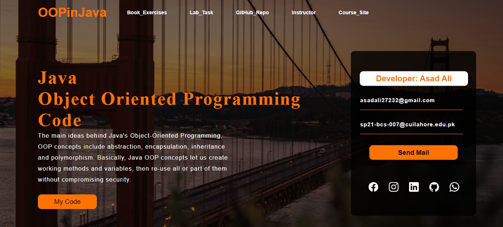

# OOP_in_Java

Welcome to the **OOP_in_Java** repository! This repository is dedicated to the exploration of Object-Oriented Programming (OOP) concepts using the Java programming language. It's a resource for 3rd-semester students diving into the world of OOP.

## Repository Contents

This repository contains various components related to your OOP in Java journey:

- **Assignments**: A collection of assignments that help reinforce your understanding of OOP principles and Java programming.

- **HelloWorld**: A simple "Hello, World!" program in Java, often the starting point for many programmers.

- **LAB Tasks by Asif Shahzad**: Lab tasks provided by Asif Shahzad, contributing to your OOP learning experience.

- **LAB Tasks by Sir Aksam**: Lab tasks from Sir Aksam, designed to further your understanding of OOP concepts.

- **Swing GUI**: Materials related to creating graphical user interfaces (GUIs) using Java's Swing library.

## Website

Explore the OOP_in_Java website to access additional resources and materials:
[OOP_in_Java Website](https://asadali27232.github.io/OOP_in_Java/)

## Technologies Used

## How to Use

1. Clone or download this repository to your local machine.
2. Use your preferred Java development environment, such as IntelliJ IDEA, to work on the assignments and tasks.
3. Explore the provided materials and resources to strengthen your understanding of OOP in Java.

Feel free to contribute, collaborate, or provide feedback to enhance this repository's value as a learning resource.

Happy coding and mastering Object-Oriented Programming in Java!

